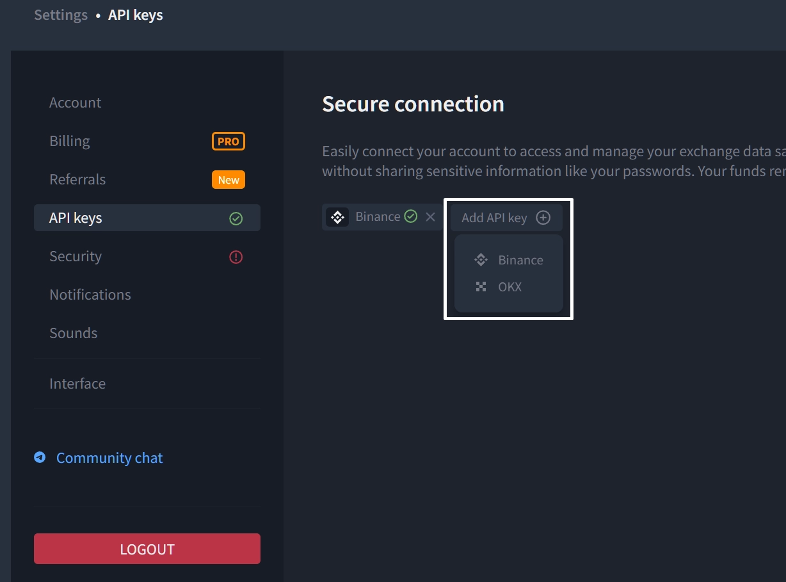
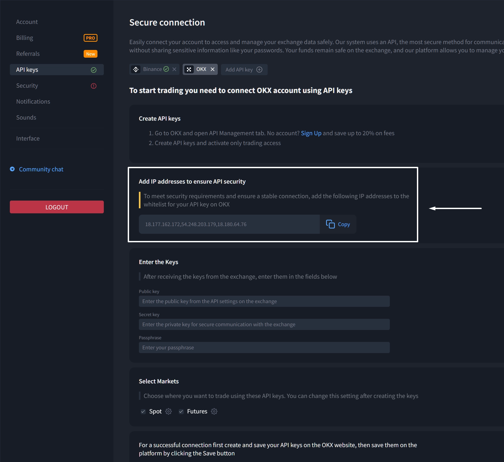
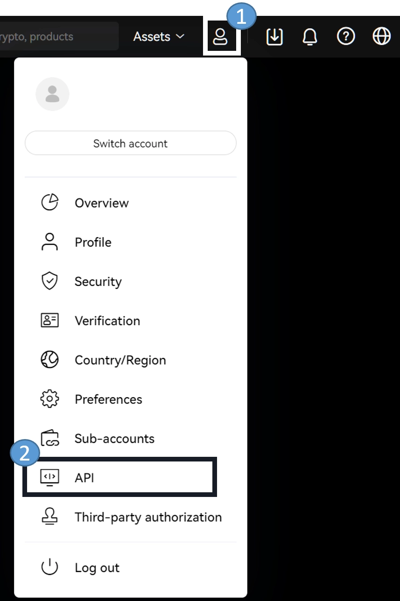
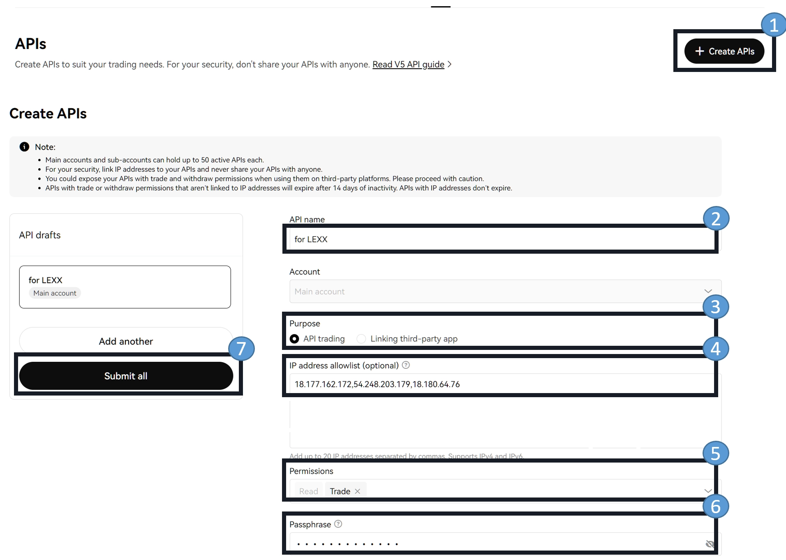

# How to Create and Connect API Keys to OKX

Setting up API keys might sound technical, but it's actually pretty straightforward—think of it as giving your trading platform a secure handshake with your exchange account. Whether you're automating trades or just want smoother integration, this guide walks you through connecting OKX to your platform without the usual headaches.

---

The platform supports connections to both Binance and OKX exchanges, but let's focus on getting OKX up and running.

## Getting Started with the Platform

First things first: click on "Add API Key" and select **OKX exchange** from the options.

You'll see a section with IP addresses listed. Hit the **"Copy"** button to grab them—you'll need these in a moment.

## Setting Up Your OKX Account

Log into your OKX account. If you don't have one yet, 👉 [grab a 20% commission rebate when you sign up here](https://www.okx.com/join/47044926) with code **47044926**.

Once you're logged in, here's what to do:

**Step 1:** Click your profile icon in the top right corner, then select **"API"** from the dropdown menu.

## Creating Your API Key

Now comes the important part. Click **"Create API"** and fill out the form carefully:

**Name your key** – Give it something memorable so you'll know what it's for later (like "Trading Bot" or "Auto Strategy").

**Select purpose** – Choose **"Trade"** from the options.

**Add IP whitelist** – Paste those IP addresses you copied earlier from the platform. This is a security feature that ensures only authorized connections can use your key.

**Set permissions** – Change the access type from "Read" to **"Trade"**. This gives the platform permission to execute trades on your behalf.

**Create a passphrase** – Think of something secure and **write it down**. You'll need this passphrase when connecting the keys to your platform and whenever you view them later. Each key has its own unique passphrase.

Once everything's filled in, the **"Submit All"** button will light up. Click it.

## Authentication and Final Connection

OKX will ask you to verify your identity—this is standard security protocol. Complete whatever authentication method you've set up (2FA, email confirmation, etc.).

After authentication, a window pops up with your key details. **Don't close it yet.**

Here's how to complete the connection:

**Copy the API Key** from OKX and paste it into the **"Public Key"** field on your platform.

**Copy the Secret Key** from OKX and paste it into the **"Private Key"** field on your platform.

Check the boxes for **"Spot"** and **"Futures"** trading (select based on what you actually plan to trade).

Hit **"Save API Keys"** and you're done.

---

## Wrapping Up

And that's it. Your platform is now securely connected to OKX and ready to execute trades. The IP whitelist and passphrase add solid security layers, while the straightforward setup means you can get back to focusing on your trading strategy rather than technical configuration. If you're still on the fence about which exchange to use, 👉 [OKX offers competitive fees and reliable API performance](https://www.okx.com/join/47044926)—definitely worth considering for automated trading setups.
